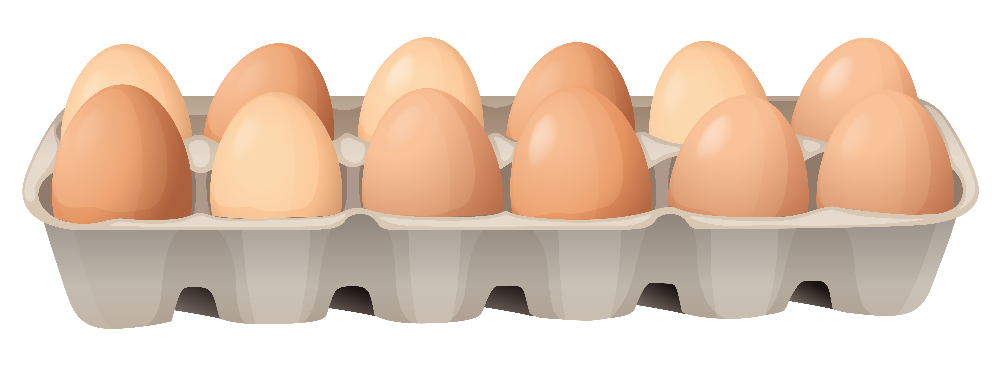

# Arrays

A linear data structure used to store elements at a contiguous location or indexes or in sequential order. They are right next to each other compared to a LinkedList that is scattered all over memory

Array in Js can be static or dynamic

## Real life examples

## Operations

| Operations | Time Complexity       | Space Complexity       |
|------------|-----------------------|------------------------|
| Access     | O(1) - constant time  | O(1) - constant space  |
| Search     | O(n) - linear time    | O(n) - linear space    |
| Insertion  | O(n) - linear time    | O(n) - linear space    |
| Deletion   | O(n) - linear time    | O(n) - linear space    |
|            |                       |                        |

## Strengths

- Access and fast lookups
- Fast push/pop
- Ordered and close to each other in memory

## Weaknesses

- Dynamic array can have additional memory
- Static array can have fixed size
- Slow inserts
- Slow deletes
