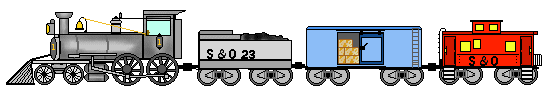

# Linked List

A linear data structure that consists of nodes where each nodes contain data and a reference/pointer to the next node in the list. They are scattered all over memory

## Real life examples

## Operations

| Operations | Time Complexity       | Space Complexity      |
|------------|-----------------------|-----------------------|
| Access     | - | -                     |
| Search     | -    | -                     |
| Insertion  | O(1) - constant time  | -                     |
| Deletion   | O(1) - constant time  | -                     |
|            |                       |                       |

## Strenghts

- Dynamic size/memory
- Insertion is constant time
- Deletion is constant time

## Weaknesses

- Additional memory for pointers
- Searching is linear time - you have to go through the items to find what you are looking for

## Singly Linked List & Doubly Linked List

|Singly Linked List  | Doubly Linked List |
|-|-|
|Singly Linked List  | Doubly Linked List |
| Less memory as we do not have to keep track of previous | More memory as we have to keep track of the previous |
| it cannot be traversed from the head or the tail | it can be traversed from the head or the tail |
| Deletion and Insertion can only happen from one side | Deletion and insertion can happen on either side |